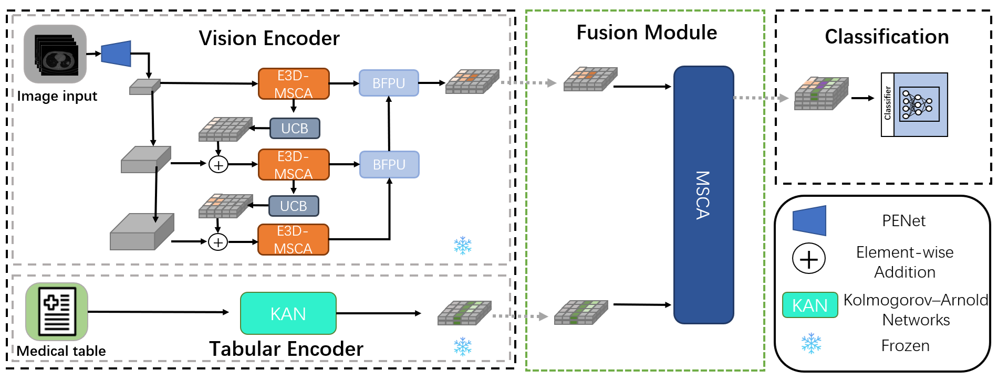
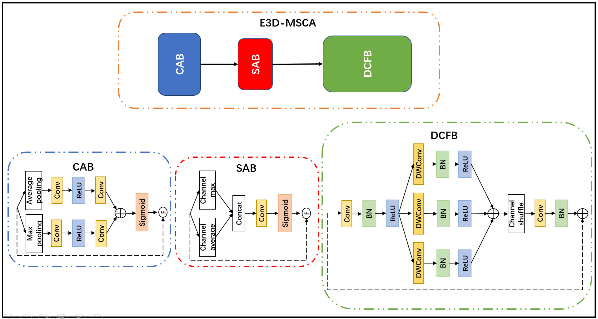
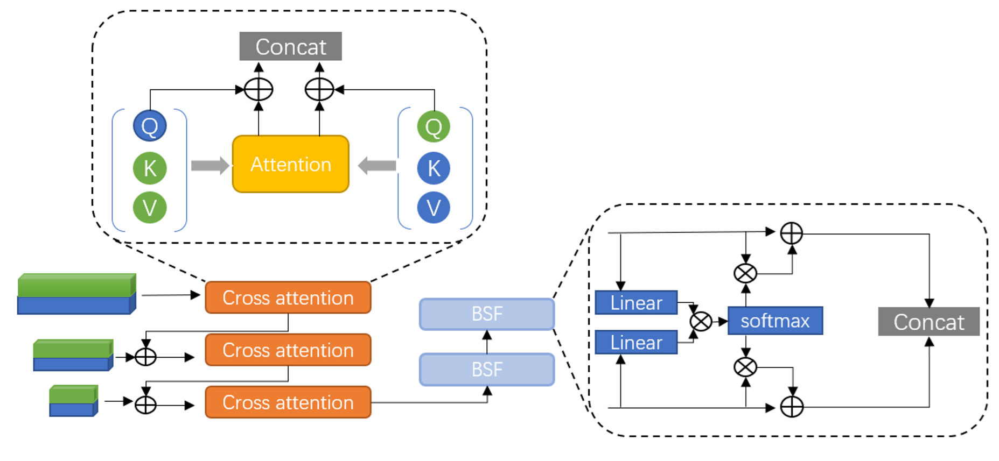

# MMCAF-Net: Multimodal Multiscale Cross Attention Fusion Network for Multimodal Disease Classification


## Proposed method
We propose a new framework called MMCAF-Net. It consists of three main components. The first component is an image encoder that integrates a feature pyramid with E3D-
MSCA module, designed to capture both local and global features of imaging data. This allows for the effective differentiation of challenging cases. The second component employs Kolmogorov–Arnold Networks (KAN) to encode tabular features. Lastly, the third component utilizes the MSCA module to align and fuse the features from both modalities.

The figure below shows our proposed network.



The figure below shows our proposed E3D-MSCA.



The figure below shows our proposed MSCA.



## Experiment result
   We compare our model with some state-of-the-art multimodal methods. The experimental results show that our model is superior to these methods.
<table>
<thead>
  <tr>
    <th>Methods</th>
    <th>AUROC</th>
    <th>ACC</th>
    <th>F1 score</th>
    <th>Specificity</th>
    <th>Sensitivity</th>
    <th>PPV</th>
    <th>NPV</th>
  </tr>
</thead>
<tbody>
  <tr>
    <td>PECon</td>
    <td>0.786</td>
    <td>0.744</td>
    <td>0.645</td>
    <td>0.786</td>
    <td>0.667</td>
    <td>0.625</td>
    <td>0.815</td>
  </tr>
  <tr>
    <td>MedFuse</td>
    <td>0.786</td>
    <td>0.721</td>
    <td>0.571</td>
    <td>0.821</td>
    <td>0.533</td>
    <td>0.615</td>
    <td>0.767</td>
  </tr>
  <tr>
    <td>Drfuse</td>
    <td>0.613</td>
    <td>0.676</td>
    <td>0.353</td>
    <td>0.800</td>
    <td>0.333</td>
    <td>0.375</td>
    <td>0.769</td>
  </tr>
  <tr>
    <td>MMTM</td>
    <td>0.802</td>
    <td>0.698</td>
    <td>0.581</td>
    <td>0.750</td>
    <td>0.600</td>
    <td>0.562</td>
    <td>0.778</td>
  </tr>
  <tr>
    <td>PEfusion</td>
    <td>0.740</td>
    <td>0.721</td>
    <td>0.600</td>
    <td>0.786</td>
    <td>0.600</td>
    <td>0.600</td>
    <td>0.786</td>
  </tr>
  <tr>
    <td>daft</td>
    <td>0.727</td>
    <td>0.729</td>
    <td>0.667</td>
    <td>0.786</td>
    <td>0.650</td>
    <td>0.684</td>
    <td>0.759</td>
  </tr>
  <tr>
    <td>MMCAF-Net</td>
    <td>0.786</td>
    <td>0.791</td>
    <td>0.690</td>
    <td>0.857</td>
    <td>0.667</td>
    <td>0.714</td>
    <td>0.828</td>
  </tr>
</tbody>
</table>

## Getting started to evaluate
### Install dependencies
```
pip install -r requirements.txt
```

### Data preprocess
Lung-PET-CT-dx dataset can get from this link https://doi.org/10.7937/TCIA.2020.NNC2-0461
In short, using create_hdf5.py to make an hdf5 file.

### Evaluation
To do the evaluation process, please run the following command :
```
sh test.sh
```

### Train by yourself
If you want to train by yourself, you can run this command :
```
sh train.sh
```
